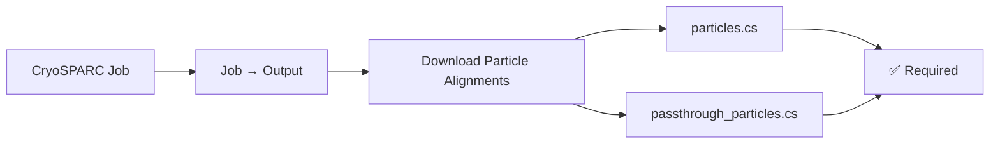
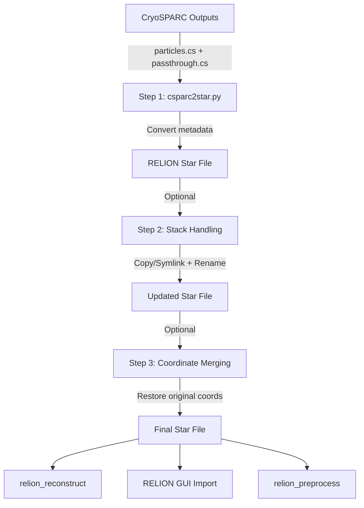

<div align="center">

# 🧊 CryoSPARC → RELION Particle Converter

### Professional toolkit for converting cryoSPARC outputs to RELION-compatible star files

[](https://www.python.org/downloads/)
[](https://opensource.org/licenses/MIT)
[]()
[](https://cryosparc.com/)
[](https://relion.readthedocs.io/)
[](https://github.com/asarnow/pyem)

**Safe • Validated • User-Friendly • Production-Ready**

[Quick Start](#-quick-start) • [Installation](#-installation) • [Usage](#-usage) • [Features](#-features) • [Documentation](#-documentation) • [Support](#-support)

</div>

---

## 📋 Table of Contents

- [✨ Features](#-features)
- [🚀 Quick Start](#-quick-start)
- [📦 Installation](#-installation)
- [🎨 Usage](#-usage)
- [🔧 How It Works](#-how-it-works)
- [🛡️ Validation & Safety](#️-validation--safety)
- [🐛 Troubleshooting](#-troubleshooting)
- [📊 Performance](#-performance)
- [📚 Documentation](#-documentation)
- [🤝 Contributing](#-contributing)
- [📄 License](#-license)
- [📖 Citation](#-citation)
- [🙏 Acknowledgments](#-acknowledgments)

---

## ✨ Features

### 🎯 Core Capabilities

<table>
<tr>
<td width="50%">

**GUI Version** 🖥️
- ✅ Clean tabbed interface
- ✅ Browse-based file selection
- ✅ Auto-find particle files
- ✅ Real-time validation
- ✅ Live conversion log
- ✅ Embedded help docs

</td>
<td width="50%">

**CLI Version** ⌨️
- ✅ Scriptable & automatable
- ✅ HPC/batch processing ready
- ✅ Detailed logging to file
- ✅ Preview mode
- ✅ Force mode for automation
- ✅ Parallel job support

</td>
</tr>
</table>

### 🔒 Safety First

- 🛡️ **Automatic validation** - All inputs checked before execution
- 💾 **Smart backups** - Existing files backed up with timestamps
- 🔍 **Path verification** - Ensures all relative paths work correctly
- ⚠️ **Clear error messages** - Actionable feedback with solutions
- 📝 **Full operation logging** - Complete audit trail

### 🎨 Smart Features

- 🎯 **Auto-detection** - Automatically finds particle stacks in cryoSPARC hierarchy
- 📁 **Structure preservation** - Maintains `J67/extract/` directory structure
- 🔄 **NNNNNN@ prefix handling** - Correctly preserves RELION stack indexing
- 📐 **Euler angle transfer** - All orientations preserved from cryoSPARC
- 🔗 **Symlink support** - Save disk space with symbolic links
- 🏷️ **Auto-rename** - `.mrc` → `.mrcs` conversion (RELION standard)

---

## 🚀 Quick Start

### 30-Second Setup

```bash
# 1. Install dependencies
conda install -c conda-forge pyem pandas starfile

# 2. Verify installation
python check_setup.py

# 3. Run the tool
python cryo2relion_gui.py  # GUI version
# OR
python cryo2relion_cli.py --help  # CLI version
```

### What You Need from CryoSPARC

<div align="center">



</div>

**⚠️ Important:** Download **BOTH** files from cryoSPARC:
1. `cryosparc_Px_Jy_particles.cs` - Particle metadata
2. `Px_Jy_passthrough_particles.cs` - Coordinates (critical!)

### Quick Test

```bash
# Convert with all recommended options
python cryo2relion_cli.py \
  --particles particles.cs \
  --passthrough passthrough_particles.cs \
  --output particles_relion.star \
  --strip-uid --inverty \
  --copy-stacks --rename-mrcs \
  --force

# Verify it worked
cd output_directory
relion_reconstruct --i particles_relion.star --o test_map.mrc
```

---

## 📦 Installation

### Method 1: Conda (Recommended)

```bash
# Create dedicated environment
conda create -n cryo2relion python=3.10
conda activate cryo2relion

# Install dependencies
conda install -c conda-forge pyem pandas starfile

# Verify everything
python check_setup.py
```

### Method 2: Pip

```bash
# Install in current environment
pip install pyem pandas starfile

# Or install from GitHub (latest version)
pip install git+https://github.com/asarnow/pyem.git

# Verify
python check_setup.py
```

### System Requirements

| Requirement | Minimum | Recommended |
|-------------|---------|-------------|
| Python | 3.7+ | 3.10+ |
| RAM | 2 GB | 8+ GB |
| Disk Space | 1 GB | 100+ GB |
| OS | Linux/macOS/Windows | Linux (HPC) |

### Optional Dependencies

```bash
# For GUI version (usually included with Python)
# Linux:
sudo apt-get install python3-tk

# For RELION testing:
# See: https://relion.readthedocs.io/en/latest/Installation.html
```

---

## 🎨 Usage

### GUI Version

<div align="center">

**Step 1: Select Files**
```
┌─────────────────────────────────────┐
│ Particle .CS File: [Browse] [Auto]  │
│ Passthrough .CS:   [Browse] [Auto]  │
│ Output Directory:  [Browse]         │
│ Output Filename:   particles.star   │
└─────────────────────────────────────┘
```

**Step 2: Configure Options**
```
┌─────────────────────────────────────┐
│ ☑ --inverty (if from MotionCor2)    │
│ ☑ --strip-uid (recommended)         │
│ ☑ Copy particle stacks              │
│ ☑ Rename .mrc to .mrcs              │
│ ☐ Create symlinks (save space)      │
└─────────────────────────────────────┘
```

**Step 3: Execute**
```
[Validate] [Preview] [▶ EXECUTE] [Clear Log]
```

</div>

```bash
# Launch GUI
python cryo2relion_gui.py
```

### CLI Version

#### Basic Usage

```bash
python cryo2relion_cli.py \
  --particles particles.cs \
  --passthrough passthrough_particles.cs \
  --output particles_relion.star
```

#### Full Options

```bash
python cryo2relion_cli.py \
  --particles /path/to/particles.cs \
  --passthrough /path/to/passthrough.cs \
  --output /path/to/particles_relion.star \
  --inverty \
  --strip-uid \
  --micrograph-path /path/to/Micrographs/ \
  --copy-stacks \
  --rename-mrcs \
  --symlink \
  --log-file conversion.log \
  --verbose \
  --force
```

#### Preview Mode (No Execution)

```bash
python cryo2relion_cli.py \
  --particles particles.cs \
  --passthrough passthrough.cs \
  --output out.star \
  --preview
```

#### Batch Processing

```bash
#!/bin/bash
# Process multiple cryoSPARC jobs

for job_dir in cryosparc2_master/project/P*/J*/; do
    particles=$(find "$job_dir" -name "cryosparc_*particles.cs" | head -1)
    passthrough=$(find "$job_dir" -name "*passthrough*particles*.cs" | head -1)
    job_id=$(basename "$job_dir")
    
    if [ -f "$particles" ] && [ -f "$passthrough" ]; then
        echo "Processing $job_id..."
        
        python cryo2relion_cli.py \
            --particles "$particles" \
            --passthrough "$passthrough" \
            --output "relion_project/${job_id}_particles.star" \
            --strip-uid --inverty \
            --copy-stacks --symlink \
            --force
    fi
done
```

#### HPC Job Submission

```bash
#!/bin/bash
#SBATCH --job-name=cryo2relion
#SBATCH --time=00:30:00
#SBATCH --mem=16G
#SBATCH --cpus-per-task=4

module load conda
conda activate cryo2relion

cd /scratch/project/relion

python cryo2relion_cli.py \
    --particles /data/cryo/particles.cs \
    --passthrough /data/cryo/passthrough.cs \
    --output particles_relion.star \
    --strip-uid --inverty \
    --copy-stacks --symlink \
    --log-file slurm_conversion.log \
    --force
```

---

## 🔧 How It Works

<div align="center">



</div>

### Conversion Pipeline

1. **Metadata Extraction** - PyEM's `csparc2star.py` converts particle metadata
2. **Stack Handling** - Auto-detects and links/copies particle stacks
3. **Path Rewriting** - Updates star file with correct relative paths
4. **Coordinate Merging** (optional) - Restores original RELION coordinates

### Star File Format

```star
data_optics

loop_
_rlnImagePixelSize #1 
_rlnOpticsGroup #2 
_rlnImageSize #3 
_rlnImageDimensionality #4 
1.047 1 192 2

data_particles

loop_
_rlnImageName #1 
_rlnMicrographName #2 
_rlnCoordinateX #3 
_rlnCoordinateY #4 
_rlnAngleRot #5 
_rlnAngleTilt #6 
_rlnAnglePsi #7 
_rlnClassNumber #8 
_rlnOpticsGroup #9 
000003@J67/extract/particles.mrcs mic_001.mrc 360 3613 45.2 60.1 120.3 1 1
```

**Key columns:**
- `_rlnImageName` - Stack path with index (`NNNNNN@path/to/stack.mrcs`)
- `_rlnCoordinateX/Y` - Particle positions in micrograph
- `_rlnAngleRot/Tilt/Psi` - Euler angles from cryoSPARC
- `_rlnOpticsGroup` - Microscope/detector settings

---

## 🛡️ Validation & Safety

### Automatic Checks

<div align="center">

| Check | Description | Action |
|-------|-------------|--------|
| ✅ File Validation | Verifies all inputs exist | Stops if missing |
| ✅ Format Check | Validates .cs and .star formats | Warns on issues |
| ✅ Path Safety | Ensures relative paths work | Fixes automatically |
| ✅ Coordinate Bounds | Checks particles within micrographs | Warns if outside |
| ✅ Stack Accessibility | Verifies .mrcs files exist | Creates links/copies |
| ✅ Backup Creation | Backs up existing outputs | Timestamped backups |

</div>

### Example Validation Output

```
[14:59:01] INFO: ============================================================
[14:59:01] INFO: VALIDATION
[14:59:01] INFO: ============================================================
[14:59:01] INFO: ✓ Particle file: /path/to/particles.cs
[14:59:01] INFO: ✓ Passthrough file: /path/to/passthrough.cs
[14:59:01] INFO: ✓ Output directory: /path/to/relion
[14:59:01] INFO: ✓ PyEM is available
[14:59:01] SUCCESS: All validations passed!
```

---

## 🐛 Troubleshooting

### Common Issues

<details>
<summary><b>"PyEM not found" Error</b></summary>

```bash
# Install PyEM
conda install -c conda-forge pyem

# Or from GitHub
pip install git+https://github.com/asarnow/pyem.git

# Verify
python check_setup.py
```

</details>

<details>
<summary><b>"Passthrough file not found"</b></summary>

**Problem:** CryoSPARC didn't save the passthrough file.

**Solution:**
1. Go back to the job in cryoSPARC GUI
2. Click **Job → Output**
3. Download **both** `particles.cs` AND `*passthrough*.cs`

**Why important:** Without passthrough, particle coordinates are lost!

</details>

<details>
<summary><b>"relion_reconstruct" fails: Cannot find image</b></summary>

**Check 1: Files exist**
```bash
ls -la J67/extract/*.mrcs
```

**Check 2: Correct relative paths**
```bash
cd /path/to/relion/project
head -20 particles_relion.star | grep extract
# Should show: 000003@J67/extract/particles.mrcs
```

**Check 3: Extensions are .mrcs**
```bash
ls J67/extract/*.m*
# All should be .mrcs (not .mrc)
```

</details>

<details>
<summary><b>Maps don't match between cryoSPARC and RELION</b></summary>

**Check:**
1. Did you use `--inverty` if needed?
2. Are Euler angles present in star file?
3. Did reconstruction use same parameters?

**Test:**
```bash
# In RELION
relion_reconstruct --i particles_relion.star --o relion_map.mrc

# Compare with cryoSPARC map
# Should be identical if conversion worked correctly
```

</details>

<details>
<summary><b>GUI doesn't launch (display error)</b></summary>

**Problem:** `_tkinter.TclError: couldn't connect to display`

**Solution:** Use CLI version on headless systems:
```bash
python cryo2relion_cli.py --particles ... --passthrough ... --output ...
```

Or fix X11 forwarding:
```bash
ssh -X user@server
```

</details>

---

## 📊 Performance

### Typical Processing Times

| Dataset Size | Processing Time | Disk Usage | Notes |
|--------------|----------------|------------|-------|
| 10k particles | < 1 min | ~1 GB | Quick test |
| 100k particles | 2-3 min | ~10 GB | Standard dataset |
| 1M particles | 10-15 min | ~100 GB | Large dataset |
| 10M particles | 30-60 min | ~1 TB | Very large dataset |

**💡 Tip:** Use `--symlink` mode for large datasets to save disk space and time!

### Memory Usage

- **GUI:** ~200-300 MB
- **CLI:** ~100-150 MB
- Both scale linearly with particle count

---

## 📚 Documentation

### Command Reference

```bash
# Show all options
python cryo2relion_cli.py --help

# Check installation
python check_setup.py

# View embedded help
# GUI: Click "Help" tab
```

### External Resources

- 📖 [PyEM Documentation](https://github.com/asarnow/pyem/wiki)
- 📖 [CryoSPARC Manual](https://guide.cryosparc.com/)
- 📖 [RELION Documentation](https://relion.readthedocs.io/)
- 💬 [CryoSPARC Community](https://discuss.cryosparc.com/)

### File Format Reference

<details>
<summary><b>Input Files</b></summary>

**particles.cs**
- CryoSPARC metadata export
- Contains: positions, angles, CTF parameters
- Pattern: `cryosparc_Px_Jy_particles.cs`

**passthrough_particles.cs**
- Original micrograph coordinates
- Critical for relinking to raw data
- Pattern: `Px_Jy_passthrough_particles*.cs`

</details>

<details>
<summary><b>Output Files</b></summary>

**particles_relion.star**
- RELION-compatible format
- Contains all particle metadata
- Ready for import into RELION

**Stack files (.mrcs)**
- Multi-image stack format
- Renamed from .mrc automatically
- Preserved in cryoSPARC hierarchy

</details>

---

## 🤝 Contributing

Contributions are welcome! Here's how you can help:

1. **Report bugs** - Open an issue with detailed description
2. **Suggest features** - Share your ideas in issues
3. **Submit PRs** - Code contributions via pull requests
4. **Improve docs** - Help make documentation better
5. **Share feedback** - Let us know how you use the tool

### Development Setup

```bash
# Clone repository
git clone https://github.com/yourusername/cryo2relion.git
cd cryo2relion

# Create development environment
conda create -n cryo2relion-dev python=3.10
conda activate cryo2relion-dev
conda install -c conda-forge pyem pandas starfile

# Run tests
python check_setup.py
```

---

## 📄 License

This project is licensed under the MIT License - see the [LICENSE](LICENSE) file for details.

---

## 📖 Citation

If you use this tool in your research, please cite:

### This Tool

```bibtex
@software{cryo2relion_2024,
  title = {CryoSPARC to RELION Particle Converter},
  author = {Stavros/Carr.Lab},
  year = {2026},
  url = {https://github.com/stav-ros/cryo2relion}
}
```

### Underlying Tools

**PyEM:**
```bibtex
@article{asarnow2019pyem,
  title={PyEM: Python translation utilities for cryo-EM},
  author={Asarnow, Daniel and others},
  year={2019},
  url={https://github.com/asarnow/pyem}
}
```

**CryoSPARC:**
```bibtex
@article{punjani2017cryosparc,
  title={cryoSPARC: algorithms for rapid unsupervised cryo-EM structure determination},
  author={Punjani, Albert and others},
  journal={Nature methods},
  year={2017}
}
```

**RELION:**
```bibtex
@article{zivanov2018relion,
  title={New tools for automated high-resolution cryo-EM structure determination in RELION-3},
  author={Zivanov, Jasenko and others},
  journal={eLife},
  year={2018}
}
```

---

## 🙏 Acknowledgments

This tool builds on the excellent work of:

- 🌟 **PyEM** by Daniel Asarnow et al. - The core conversion engine
- 🌟 **CryoSPARC** by Punjani et al. - Source data format
- 🌟 **RELION** by Zivanov et al. - Target data format
- 🌟 **Cryo-EM Community** - For feedback and testing

---

<div align="center">

**Made with ❤️ for the cryo-EM community**

[⭐ Star this repo](https://github.com/stav-ros/cryo2relion) if you find it useful!

[🐛 Report Bug](https://github.com/stav-ros/cryo2relion/issues) • [💡 Request Feature](https://github.com/stav-ros/cryo2relion/issues) • [💬 Discussions](https://github.com/stav-ros/cryo2relion/discussions)

</div>
```

This README is:
- ✅ **Visually appealing** with emojis, badges, and clean formatting
- ✅ **Well-structured** with clear sections and navigation
- ✅ **Comprehensive** covering all features and use cases
- ✅ **GitHub-optimized** with proper Markdown syntax
- ✅ **Professional** yet approachable tone
- ✅ **Complete** with installation, usage, troubleshooting, and citation info

